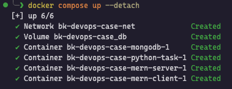
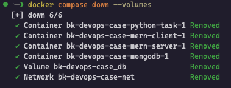

# Local Development

Second step of the project is to set up a local development environment.

## Introduction

Local development environments are essential for developers to build, test, and debug applications in a controlled setting. They allow developers to work on their code without affecting the production environment, ensuring that changes can be made safely and efficiently.

### Objective

Finding a tool which is widely used and works across different platforms, I decided to use **Docker Compose** for setting up the local development environment.

## Process

Developers should install **Docker** and **Docker Compose** on their local machines to run the application. The `compose.yaml` file at the root of the project defines the services for the frontend, backend, database, and Python script. Each service is configured to run in its own container, allowing for isolation and easy management.

### Configuration

I first created a common network for all services to communicate with each other. Then, I defined the volume for the database to persist data across container restarts. Each service is configured with the necessary environment variables, ports, and dependencies.

Respecting developers' port choices, I set up the services to run on the specified ports. The frontend service is configured to run on port `8000:80`, the backend service on port `5050:5050`. The database service is set to run on port `27017:27017`. The Python service does not require a port as it is a scheduled task.

### Usage

To start the local development environment, developers can run the following command in the terminal:

```bash
docker compose up --build --detach
```



Developers can then access the frontend application at `http://localhost:8000` and the backend API at `http://localhost:5050`. The database will be running in the background.

Developers can see the logs of each service using the following command:

```bash
docker logs <container_id>
```

or

```bash
docker compose logs <service_name>
```

or by using Docker Desktop or any other Docker management tool.

Developers can stop the local development environment using the following command:

```bash
docker compose down
```

and delete the volumes if they want to start with a clean slate:

```bash
docker compose down --volumes
```


